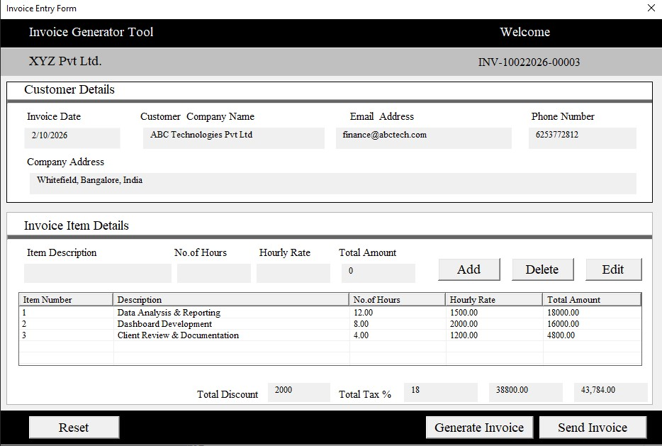
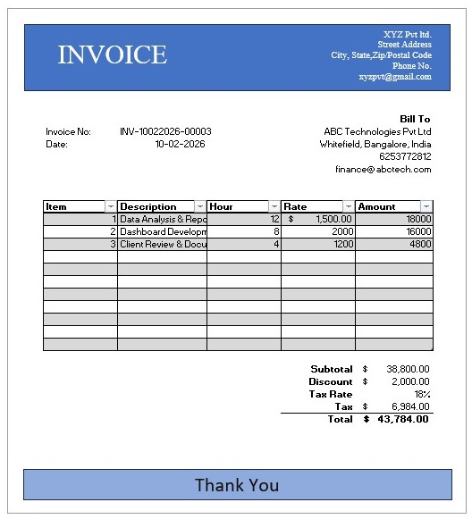
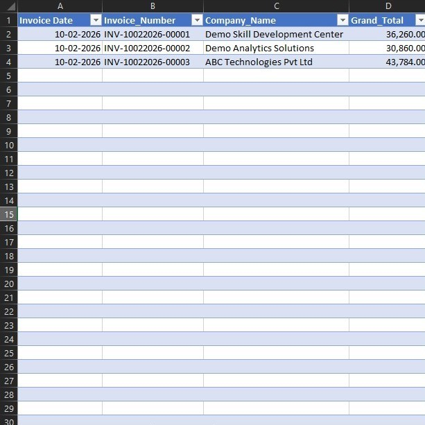
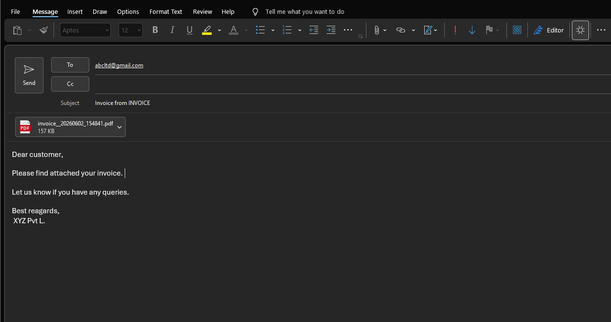

# 🧾 Automated Invoice Generator (Excel + VBA + Outlook Automation)

## 📌 Project Overview
The Automated Invoice Generator is an Excel-based automation project developed using VBA (Visual Basic for Applications). It is designed to automate the complete invoicing process including data entry, invoice generation, record maintenance, and email delivery via Microsoft Outlook.

This project simulates a real-world billing system used in small and medium businesses to reduce manual effort and improve accuracy in financial transactions.

---

## 🎯 Objective
- Automate invoice creation using Excel VBA  
- Eliminate manual calculation errors  
- Maintain structured customer and billing records  
- Automate sending invoices via Outlook email  
- Improve overall billing efficiency  

---

## ⚙️ Tools & Technologies Used
- Microsoft Excel  
- VBA (Visual Basic for Applications)  
- Microsoft Outlook (Email Automation)

---

## 🚀 Key Features
- UserForm-based data entry system  
- Automated invoice generation  
- Dynamic calculation of subtotal, tax, discount, and total  
- Add, Edit, and Delete invoice items  
- Record maintenance for all transactions  
- Structured invoice format generation  
- Send invoice directly via Outlook email  
- Reset form functionality for new entries  

---

## 🧠 Workflow
1. User enters customer and item details using VBA UserForm  
2. VBA processes the input data  
3. Invoice is automatically generated in Excel  
4. Data is stored in a structured sheet for records  
5. Invoice is optionally sent via Outlook email  

---

## 📁 Project Files
- Automated Invoice Generator.xlsm → Main Excel workbook with automation  
- UserForm1.frm → VBA UserForm interface code  
- UserForm1.frx → UserForm design file  
- Screenshots (.jpg) → User interface, invoice output, and data storage  

---

## 📷 Screenshots
### UserForm Interface  

### Generated Invoice  

### Data Storage  

### Outlook Email Automation

---

## 📧 Outlook Email Automation
This project includes automated email functionality using Microsoft Outlook:
- Invoice is generated in Excel  
- VBA triggers Outlook application  
- Invoice is sent automatically via email  
- Reduces manual emailing effort  

---

## 📊 Benefits
- Saves time in invoice creation  
- Reduces human errors in calculations  
- Automates end-to-end billing process  
- Improves business productivity  
- Useful for small business automation  

---

## 🔮 Future Improvements
- PDF invoice export feature  
- Cloud database integration  
- Web-based invoice system  
- Multi-user login system  
- Advanced analytics dashboard  

---

## 👨‍💻 Author
**Jyothi D V**

---

## 📌 Conclusion
This project demonstrates how Excel VBA can be used to build a complete business automation system that handles invoice generation, record maintenance, and email automation using Outlook. It showcases real-world problem-solving, automation skills, and business workflow optimization.
